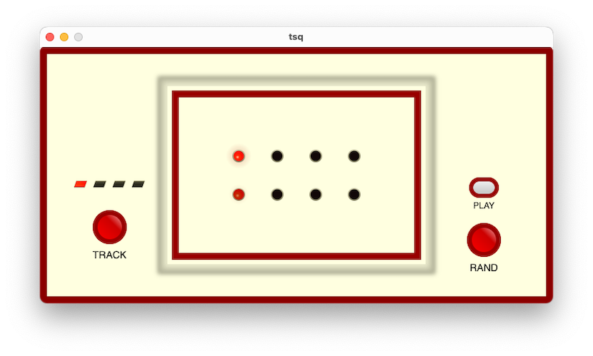

# tsq
[](https://github.com/eiri/tsq/actions/workflows/ci.yml)
[](LICENSE)

A toy 8-step sequencer.



## Summary

8-step sequencer that loops a rhythmic pattern, with a kick drum, open and closed hi-hat, and a melodic tone (sine or square) voice. BPM is fixed at 120. Patterns can be randomized at runtime.

## Tracks

- kick
- snare
- open/closed hi-hat
- tone (sine or square)

The tone track plays notes from the C major scale (C4–C5), one per step.

## Controls

| Key | Action |
|-----|--------|
| `p` | start/stop play |
| `t` | choose instrument track |
| `r` | randomize pattern |
| `CMD+Q` | quit |

## Build & Run

```bash
$ cargo build
$ cargo test
$ cargo run
```

## License

[MIT](https://github.com/eiri/tsq/blob/main/LICENSE)
