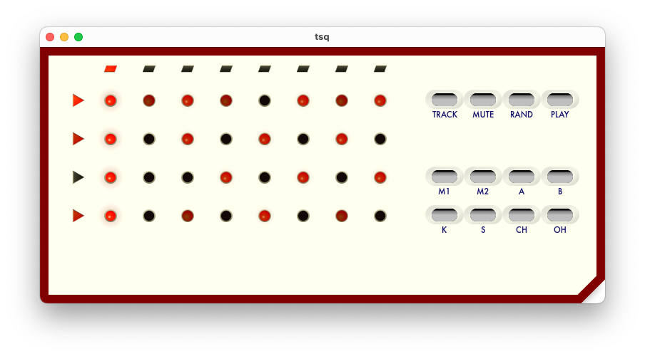

# tsq

[](https://github.com/eiri/tsq/actions/workflows/ci.yml)
[](LICENSE)

A toy 8-step music sequencer that uses emulated YM2149 sound chip.



## Tracks

- Melody: notes from C4 to C5, with two sound variations (M1 and M2).
- Arpeggio: a group of notes played one after another with a different voice.
- Bass: low notes with a rounded sound.
- Drums: kick, snare, and open or closed hi-hat.

## Controls

| Key     | Action                    |
| ------- | ------------------------- |
| `p`     | Start or stop playback    |
| `t`     | Select the next track     |
| `m`     | Mute or unmute that track |
| `r`     | Randomize selected track  |
| `CMD+Q` | Quit                      |

## Implementation details

`tsq` uses an emulated YM2149 chip clocked at the MSX rate of about 1.79 MHz. A 60 Hz player changes pitch, volume, and noise settings while the chip generates the sound between updates. Melody uses channel A, arpeggios use B, and bass and drums take turns on C. Each voice follows its own software volume sequence since the chip has only one shared hardware envelope. Bass and drums share same channel, so drums can cut off bass notes.

## Build & Run

```bash
$ cargo build
$ cargo test
$ cargo run
```

## License

[MIT](LICENSE)
